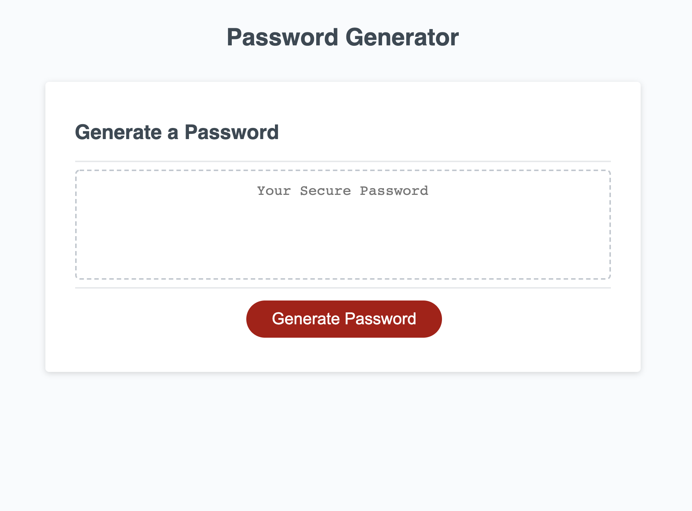
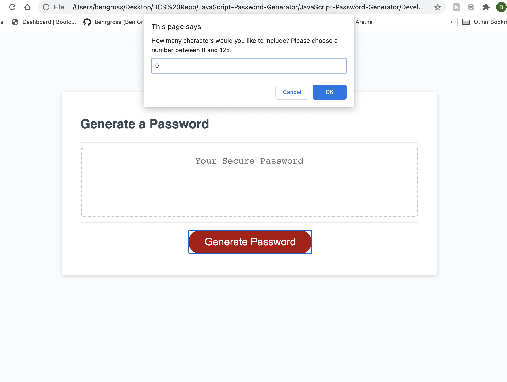

# JavaScript-Password-Gennerator

To help better understand JavaScript a random password generating function was deployed. On the webpage the user can start the password generating function by clicking on the "Generate Password" button. When clicked the user is prompted to input a number between 8 - 125. When this condition is not met the user is prompted with a window asking them to, "Please choose a number between between 8 and 125." If the condition is met the user is able to confirm, through a series of confirmation pop up windows, if they would like to include uppercase letter, lowercase letters, symbols and numbers. Given the users decisions, the function pulls the character sets into an array and randomly selects the number of characters defined by the user. The random character array is then converted into string and displayed on the webpage for the user to use.

[Alt text](images/Password-error.png)

[Alt text](images/Password-lower.png)

[Alt text](images/Password-upper.png)

[Alt text](images/Password-numbers.png)

[Alt text](images/Password-symbols.png)

[Alt text](images/Password-final.png)

link to webpage https://benrgross.github.io/JavaScript-Password-Generator/
